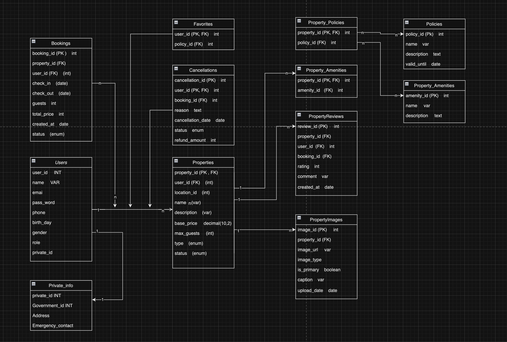

# Dự án AirBnb API

Đây là một dự án API backend cho một ứng dụng tương tự như AirBnb, được xây dựng bằng NestJS.

## Video Demo
Xem demo của dự án tại: [YouTube](https://youtu.be/h11XwEgWaY4)

## Công nghệ sử dụng

- NestJS: Framework backend chính
- TypeScript: Ngôn ngữ lập trình
- Prisma: ORM và quản lý cơ sở dữ liệu
- Swagger: Tạo tài liệu API tự động
- JWT: Xác thực người dùng
- Cloudinary: Lưu trữ và quản lý hình ảnh
- Class Validator: Kiểm tra và xác thực dữ liệu đầu vào

## Cài đặt

1. Clone repository
2. Chạy `npm install` để cài đặt các dependencies
3. Cấu hình các biến môi trường trong file `.env`
4. Chạy `npm run start:dev` để khởi động server ở chế độ phát triển

## Các Endpoint chính

### Authentication
- POST /auth/signup: Đăng ký người dùng mới
- POST /auth/login: Đăng nhập người dùng

### Users
- GET /users/get-all-user: Lấy danh sách tất cả người dùng
- GET /users/search-user-by-name: Tìm kiếm người dùng theo tên
- GET /users/search-user-by-email: Tìm kiếm người dùng theo email
- GET /users/get-user-by-id/:id: Lấy thông tin người dùng theo ID
- PUT /users/edit-user/:id: Cập nhật thông tin người dùng

### Properties
- GET /property: Lấy danh sách tất cả các property
- GET /property/amenities: Tìm kiếm property theo tiện nghi
- GET /property/search: Tìm kiếm property theo vị trí
- GET /property/:id: Lấy thông tin chi tiết của một property
- GET /property/type/:type: Lấy danh sách property theo loại
- POST /property/create-new-property: Tạo một property mới
- PUT /property/update-property-status/:id: Cập nhật trạng thái của một property
- PUT /property/update-location/:id: Cập nhật vị trí của một property

### Bookings
- POST /booking: Tạo một đặt phòng mới
- GET /booking/:id: Lấy thông tin đặt phòng theo ID
- PUT /booking/:id/status: Cập nhật trạng thái đặt phòng
- GET /booking/user/:userId: Lấy danh sách đặt phòng của một người dùng
- POST /booking/cancel: Hủy đặt phòng

### Reviews
- POST /reviews: Tạo một đánh giá mới
- GET /reviews/property/:propertyId: Lấy tất cả đánh giá cho một property
- PUT /reviews/rating: Cập nhật đánh giá sao của một review
- PUT /reviews/comment: Cập nhật nhận xét của một review
- DELETE /reviews: Xóa một đánh giá

### Favorites
- POST /favorites: Thêm một property vào danh sách yêu thích
- DELETE /favorites: Xóa một property khỏi danh sách yêu thích
- GET /favorites/:userId: Lấy danh sách property yêu thích của một người dùng

# Database

